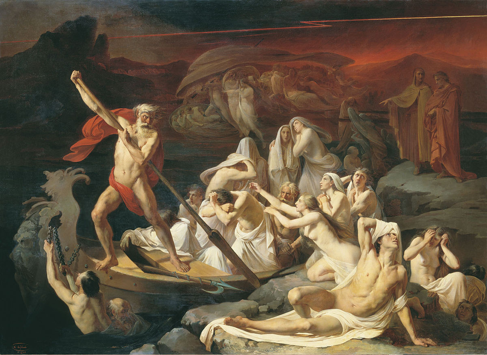

# Charon

Charon is the ferryman to the underworld in Greek mythology. It's also a simple website that displays a different state depending on the status of a VPN server. If the VPN server is online, it displays an image. If the VPN server is offline, and you need use of it, then it allows you to send a simple request to launch the server, assuming you know the magic word.

## That sounds kinda silly. Why do this?

I have a group of friends that wanted access to a VPN server, but they were unsure about setting one up or buying a VPN service. This provides a way for them to use a shared VPS on a cloud hosting provider (very affordable) without incurring large costs and without needing to have access to the cloud hosting provider directly. This also completely bypasses [all of the terrible problems](https://gist.github.com/kennwhite/1f3bc4d889b02b35d8aa) that come with using a commercial VPN provider. You're not trusting anyone but yourself with your traffic.

## Technology

- Cloud: [AWS](https://aws.amazon.com/)
- Server: [Algo](https://github.com/trailofbits/algo)
- Client: [Wireguard](https://www.wireguard.com/)
- Website: [HTML/CSS/Vanilla JS](https://github.com/rchillard/charon/blob/master/client/)
- Backend: [NodeJS function](https://github.com/rchillard/charon/blob/master/lambda/index.js) in AWS Lambda, using API Gateway

You can host the website anywhere you like, as it's simple HTML/CSS/JavaScript. The backend function for processing the request is written in Node, so any Function-as-a-Service offering should run it.

## Cost

My example is running on a small (t2.micro) AWS instance that costs ~$5/month, if it runs all the time.  Since it's setup to shutdown when no one is connected, this normally costs <$1-5/month, which is competitive with most commercial VPN services.

Here's a sample of my real costs (in USD) over 6 months:
Month | Cost
----- | ----
1 | $4.36
2     | $2.70
3 | $2.46
4     | $3.49
5 | $4.12
6     | $5.15
Total | \$22.28

# Setup

These are general setup instructions. I may revisit this project to automate these things later:

1. Install [Algo](https://github.com/trailofbits/algo) following their directions for AWS
2. Setup CloudWatch alarms to automatically shutdown the server if there's no network traffic over 15 minutes
3. Deploy the backend function to Lambda, exposing it as a simple HTTP endpoint in API Gateway
4. Update your Charon client or frontend (index.js) file with the API Gateway endpoint

When you create a server using Algo, it will generate an Elastic IP. You should delete the Elastic IP, as you will:

- Not need it, because Charon will retrieve the IP of the running server and display it
- AWS will bill you for reserving an Elastic IP but _not_ using it. Remember your VPN server will be offline when you're not using it, so most of the time.

## Security

One thing to note is that Charon requires a publicly available HTTP endpoint that's going to be used to activate your backend function. This endpoint will be available to anyone with basic development tools, as it's going to live on the client. As a result, you should severely rate limit this endpoint, so bad actors can't run up your bill.
